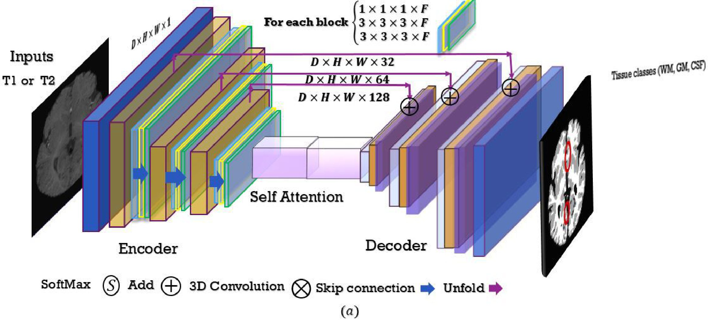
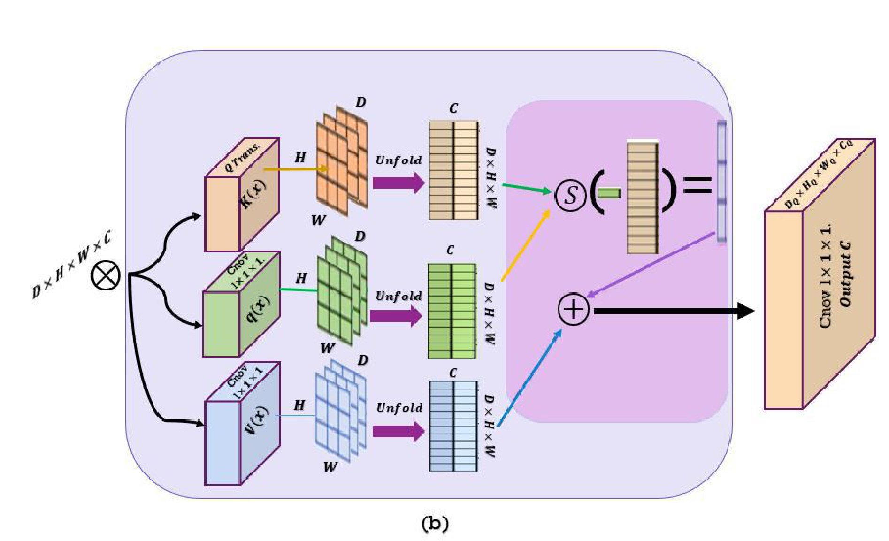
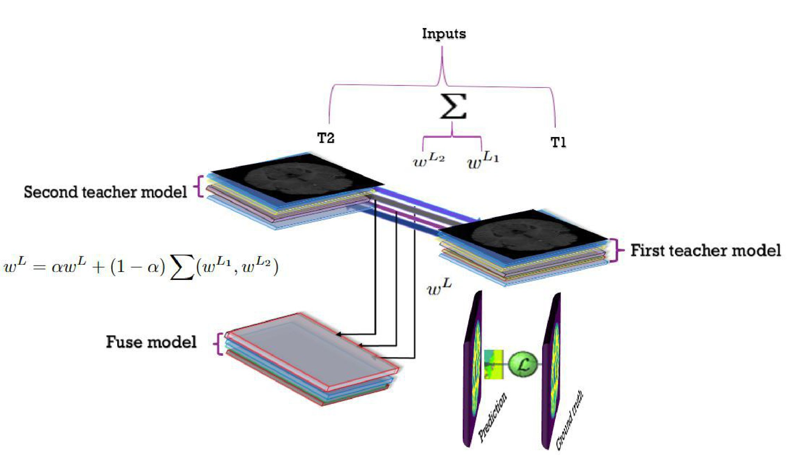
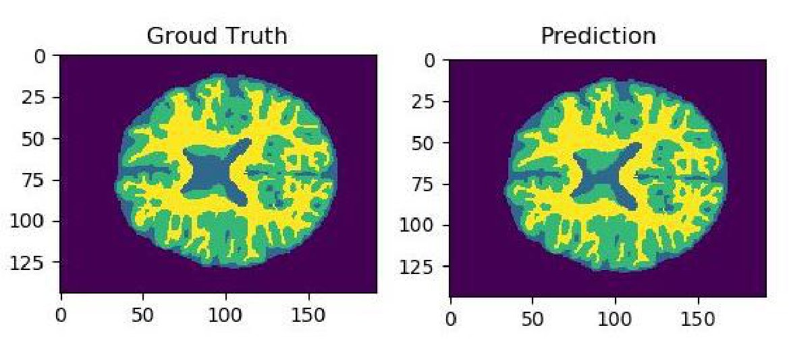

### Two Independent Teachers are Better Role Model

This repository contains the tensorflow  of the model we proposed in our paper: Two Independent Teachers are Better Role Model

The code is available in tensorflow. To run the project kindly refer to the individual readme file.

### Dataset

iSEG 2017 dataset was chosen to substantiate our proposed method. It contains the 3D multi-modal brain MRI data of 10 labeled training subjects and 13 unlabeled testing subjects.

MRBrainS13 dataset was also used to test the robustness of our proposed model. It contains 3 modalities. Original Dataset consists of 5 labeled training and 6 unlabeled testing subjects. 

### Proposed model architecture

The following shows the model architecture of the proposed model. (Read our paper for further details)

### Some results from our paper

### Comparison on the 150-th slice results in M ICCAI iSEG dataset.

### Contact

###  You can mail us at: 

Afifa Khaled 
Computer Science and Technology
Huazhong University of Science and Technology
Wuhan 430074, China
afifakhaied@tju.edu.cn

Ahmed A. Mubarak
College of Applied Sciences and Educational
IBB University
IBB, Yemen
ahmedmubarak@ibbuniv.edu.ye

Kun He
School of Computer Science and Technology
Huazhong University of Science and Technology
Wuhan 430074, China
brooklet60@hust.edu.cn

If you use this code for your research, please consider citing the original paper:

We have submitted the manuscript to Journal of IEEE Transactions on Medical Imaging (TMI) in June 2023

 

