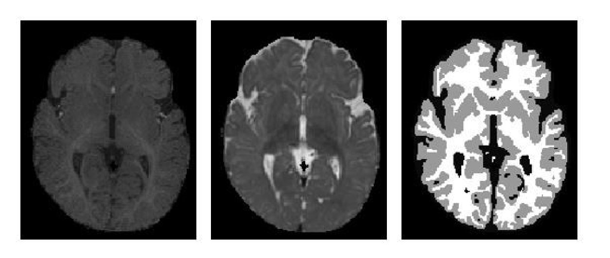
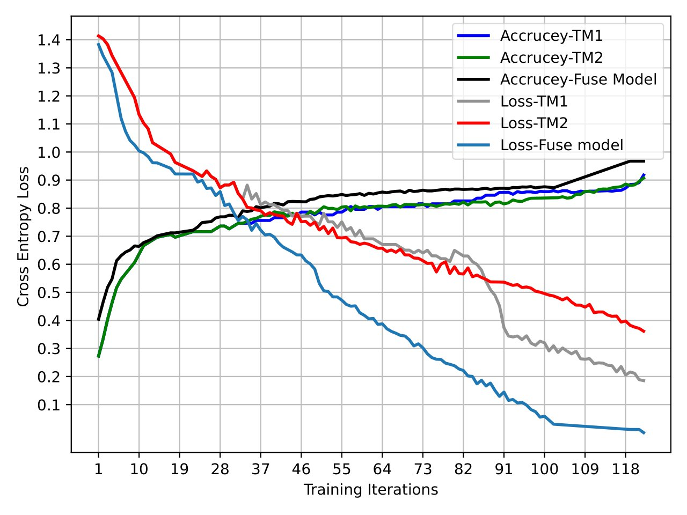
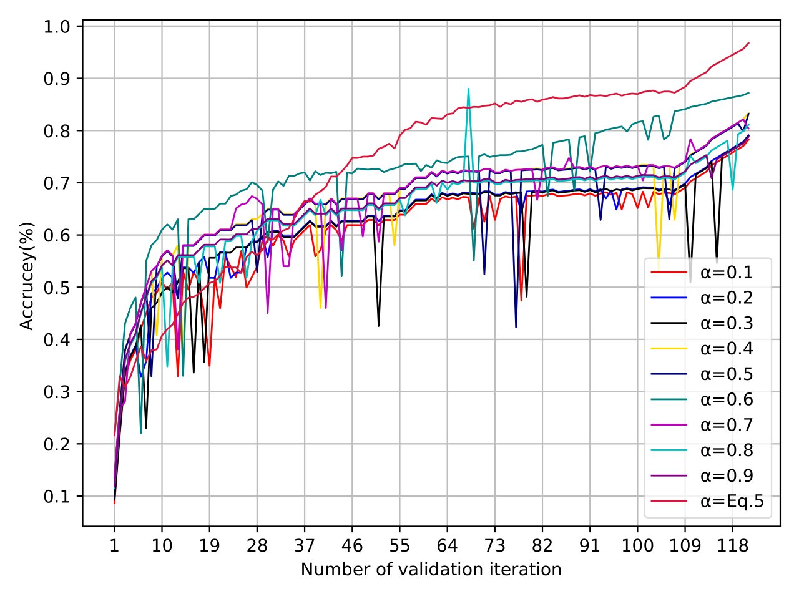
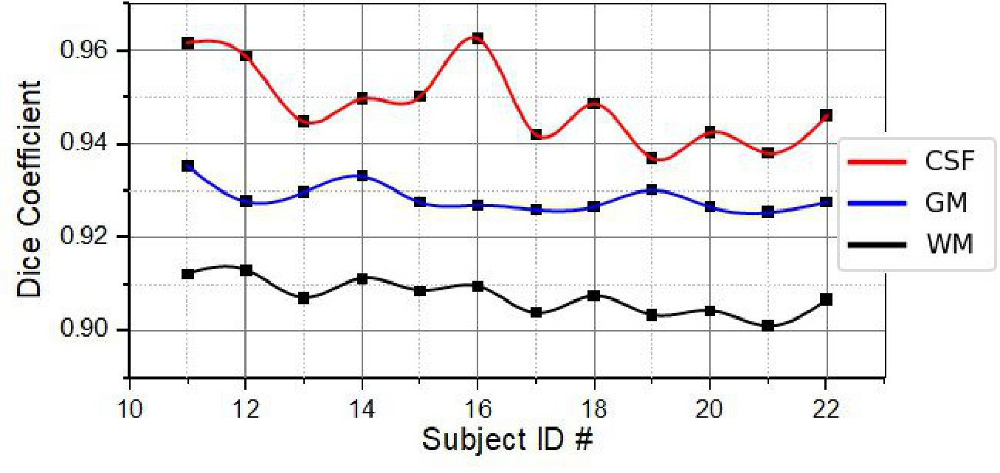

# Two Independent Teachers are Better Role Model

(Link for the paper https://arxiv.org/abs/2306.05745)
  

This repository contains the tensorflow  of the model we proposed in our paper: Two Independent Teachers are Better Role Model

The code is available in tensorflow. To run the project kindly refer to the individual readme file.

## Dataset

iSEG 2017 dataset was chosen to substantiate our proposed method. It contains the 3D multi-modal brain MRI data of 10 labeled training subjects and 13 unlabeled testing subjects.

   

MRBrainS13 dataset was also used to test the robustness of our proposed model. Original Dataset consists of 5 labeled training and 6 unlabeled testing subjects. 

### Since, as you might now, sharing medical data is not a good-practice, I did not include any sample in the corresponding folders. To make your experiments you must include your data in the repositories indicated in the configure.py file

## Proposed model architecture

### Framework of the proposed model with (a) 3D-DenseUNet architecture 

### A global attention block with 3D layers based on multi-head attention as the self-attention.

### Illustration of the fused weights from teacher models to the fuse mode

#### Read our paper for further details

##   Requirements
####  Programming language

The code has been written in Python (3.6.15) and requires
scipy,
tensorflow,
numpy.

#### The code required  to load images in Nifti formats. And  you should install nibabel

## Some results from our paper

### Comparison on the 150-th slice results in M ICCAI iSEG dataset.

#### The accuracy and loss validation for propose model at M ICCAI iSEG dataset

#### The accuracy of validation dataset on M ICCAI iSEG with various setting of α

#### Performance of the proposed model on 13 different subjects of M ICCAI iSEG dataset as test set

## Contact

####  You can mail us at: 

#### Afifa Khaled 

afifakhaied@tju.edu.cn

#### Ahmed A. Mubarak

ahmedmubarak@ibbuniv.edu.ye

#### Kun He
brooklet60@hust.edu.cn

## If you use this code for your research, please consider citing the original paper:

We have submitted the manuscript to Journal of IEEE Transactions on Medical Imaging (TMI) in June 2023

[Link](https://arxiv.org/abs/2306.05745)
